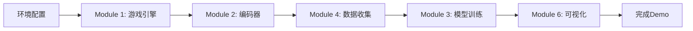

# 📚 基于世界模型的2D平台游戏 - 技术文档

> **完全初学者友好** | 从零开始构建AI驱动的游戏引擎

---

## 🎯 项目概述

这是一个**网页版2D平台跳跃游戏**，核心特色是使用**世界模型（World Model）**预测游戏未来状态。

**你会学到：**
- ✅ 如何用Phaser.js开发2D游戏
- ✅ 如何用TensorFlow.js训练AI模型
- ✅ 如何将机器学习集成到游戏中
- ✅ 完整的前端+AI项目开发流程

**最终效果：**
```
游戏画面分为两半：
├─ 左侧：你正常玩的真实游戏
└─ 右侧：AI预测的未来3-5帧画面
```

---

## 📖 文档导航

### 🚀 快速开始

| 文档 | 内容 | 适合人群 |
|------|------|----------|
| [00-项目初始化指南](./00-项目初始化指南.md) | 安装工具、配置环境 | **所有人必读** |

### 🎮 核心模块（按顺序学习）

| 模块 | 文档 | 核心技术 | 学习时长 |
|------|------|----------|----------|
| **Module 1** | [基础游戏引擎](./01-Module1-基础游戏引擎.md) | Phaser.js, 物理引擎 | 1-2天 |
| **Module 2** | [状态编码器](./02-Module2-状态编码器.md) | 特征工程, 归一化 | 0.5-1天 |
| **Module 3** | [动态预测模型](./03-Module3-动态预测模型.md) | TensorFlow.js, 神经网络 | 1-2天 |
| **Module 4** | [数据收集工具](./04-Module4-数据收集工具.md) | 自动化, AI玩家 | 1天 |
| **Module 5** | [模型训练脚本](./05-Module5-模型训练脚本.md) | Python, TensorFlow | 1-2天 |
| **Module 6** | [预测可视化](./06-Module6-预测可视化.md) | Canvas渲染, 分屏技术 | 1-2天 |

**总学习周期：** 1-2周（全职） | 3-4周（业余）

---

## 🗺️ 学习路线图

### 路线A: 完整学习（推荐）



### 路线B: 快速体验（跳过Python训练）

```
Day 1: 环境配置 + Module 1
Day 2: Module 2 + Module 4
Day 3: Module 3 (仅浏览器版)
Day 4: Module 6
```

### 路线C: AI专注（已有游戏基础）

```
快速过: Module 1
重点学: Module 2 → 5 → 6
扩展: 自定义模型架构、高级训练技巧
```

---

## 📁 项目结构速查

```
mirror_chunyun/
├─ docs/                    # 📚 你现在在这里！
│  ├─ README.md            # 本文档
│  ├─ 00-项目初始化指南.md
│  ├─ 01-Module1-基础游戏引擎.md
│  ├─ 02-Module2-状态编码器.md
│  ├─ 03-Module3-动态预测模型.md
│  ├─ 04-Module4-数据收集工具.md
│  ├─ 05-Module5-模型训练脚本.md
│  └─ 06-Module6-预测可视化.md
│
├─ src/                     # 源代码
│  ├─ main.ts              # 入口
│  ├─ game/                # Module 1
│  ├─ model/               # Module 2 & 3
│  ├─ tools/               # Module 4
│  └─ ui/                  # Module 6
│
├─ train/                   # Module 5
│  ├─ train.py
│  ├─ model.py
│  └─ data_loader.py
│
├─ public/
│  ├─ models/              # 训练好的模型
│  └─ assets/              # 游戏资源
│
├─ data/                    # 训练数据
├─ package.json
├─ tsconfig.json
└─ vite.config.ts
```

---

## 🎓 学习建议

### 对于完全初学者

**第一步：** 不要着急看所有文档！

1. **先看** `00-项目初始化指南.md`，搭建环境
2. **再看** `01-Module1-基础游戏引擎.md`，运行起游戏
3. **边做边学** 其他模块

**遇到问题怎么办？**
- 每个文档末尾有"常见问题"章节
- 搜索关键词（如"NaN错误"）
- 查看代码注释（每行都有详细解释）

### 对于有编程经验的开发者

**可以跳过的内容：**
- 技术栈基础解释
- 代码注释中的基础概念

**重点关注：**
- 架构设计章节
- 代码框架
- 优化技巧

---

## 🧰 技术栈总览

### 前端技术

| 技术 | 用途 | 难度 | 官方文档 |
|------|------|------|----------|
| **TypeScript** | 编程语言 | ⭐⭐⭐ | [typescriptlang.org](https://www.typescriptlang.org/) |
| **Phaser.js** | 游戏引擎 | ⭐⭐⭐ | [phaser.io](https://phaser.io/) |
| **TensorFlow.js** | 机器学习 | ⭐⭐⭐⭐ | [tensorflow.org/js](https://www.tensorflow.org/js) |
| **Vite** | 构建工具 | ⭐⭐ | [vitejs.dev](https://vitejs.dev/) |

### 后端技术（训练用）

| 技术 | 用途 | 难度 |
|------|------|------|
| **Python** | 训练语言 | ⭐⭐ |
| **TensorFlow** | 深度学习 | ⭐⭐⭐⭐ |
| **NumPy** | 数值计算 | ⭐⭐⭐ |

---

## ✅ 检查清单

### 环境配置完成 ✓

- [ ] Node.js 已安装（v18+）
- [ ] Python 已安装（3.10+）
- [ ] VSCode 已安装
- [ ] 项目依赖已安装（npm install）
- [ ] 能成功运行 `npm run dev`

### 模块学习进度

- [ ] Module 1: 基础游戏引擎
- [ ] Module 2: 状态编码器
- [ ] Module 3: 动态预测模型
- [ ] Module 4: 数据收集工具
- [ ] Module 5: 模型训练脚本
- [ ] Module 6: 预测可视化

### 最终验收

- [ ] 能玩基础游戏
- [ ] 能收集训练数据
- [ ] 能训练模型
- [ ] 能看到预测可视化
- [ ] 预测误差 < 10px

---

## 🚀 快速命令参考

```bash
# 开发模式（正常游戏）
npm run dev

# 数据收集模式
npm run collect-data

# 构建生产版本
npm run build

# Python训练模型
python train/train.py --data data/training_data.json

# 转换为浏览器格式
python train/convert_to_tfjs.py \
  --input models/dynamics_v1 \
  --output public/models/dynamics-model
```

---

## 📊 学习成果展示

完成本项目后，你将能够：

1. **独立开发2D游戏**
   - 物理引擎应用
   - 游戏循环设计
   - 碰撞检测实现

2. **应用机器学习**
   - 数据收集与预处理
   - 神经网络训练
   - 模型部署与优化

3. **全栈项目实践**
   - 前端框架使用
   - Python数据处理
   - 项目工程化

---

## 🎯 下一步扩展方向

### 游戏玩法

- [ ] 添加敌人AI
- [ ] 程序化生成关卡
- [ ] 多人联机模式
- [ ] 排行榜系统

### AI增强

- [ ] 不确定性建模
- [ ] 强化学习集成
- [ ] 自动难度调整
- [ ] 玩家行为分析

### 技术优化

- [ ] WebGL渲染优化
- [ ] Web Worker多线程
- [ ] IndexedDB数据缓存
- [ ] PWA离线支持

---

## 💡 常见问题汇总

### Q: 我没有AI基础，能学会吗？
**A:** 可以！文档从零开始讲解，每个概念都有通俗解释。

### Q: 一定要学Python吗？
**A:** 不一定。Module 3提供了纯浏览器训练方案，只是效果略差。

### Q: 能用其他游戏引擎吗（如Unity）？
**A:** 可以，核心思想相同，但需要适配API。

### Q: 训练需要GPU吗？
**A:** 不强制，但有GPU会快很多（尤其Module 5）。

---

## 📞 获取帮助

**遇到问题时：**

1. **先查看** 对应模块文档的"常见问题"章节
2. **再检查** 代码注释和示例
3. **搜索错误** 在Google搜索完整错误信息
4. **查阅官方文档** Phaser.js / TensorFlow.js

---

## 🎉 开始你的学习之旅

**推荐起点：**

1. 📖 阅读 [00-项目初始化指南](./00-项目初始化指南.md)
2. 🎮 动手实践 [01-Module1-基础游戏引擎](./01-Module1-基础游戏引擎.md)
3. 🚀 一步步完成所有模块

**祝你学习愉快！** 🎊

---

_最后更新时间: 2025-01-15_
